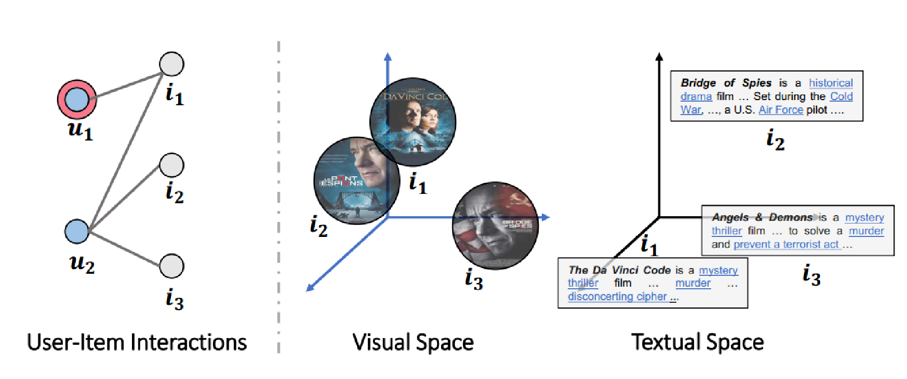
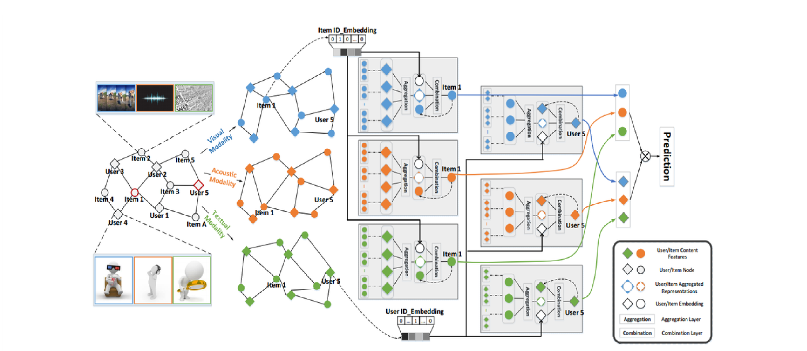

# 
Multi-modal GCN for Personalized Recommendation of Micro-video

## 1. 简介
&emsp;利用user-item交互来指导每种模式下的表征学习，进一步实现个性化的短视频推荐。
&emsp;设计了一个基于图神经网络消息传递思想的多模态图卷积网络(MMGCN)框架。该框架可以生成用户和短视频的特定模态表示，以更好地捕获用户偏好。具体来说，在每个模态中构造一个user-item二分图，并用其相邻节点的拓扑结构和特征丰富每个节点的表示。通过实验，证明了该模型能够显著优于最先进的多模式推荐方法。
&emsp;这种将多模态信息整合到用户与短视频之间的历史交互中的方式，有助于更加深入了解用户偏好，原因如下:
* 不同模态之间存在语义差异。同一模态的相似并不足够说明短视频之间的相似。如图一所示，在Visual Space中，$i_1$与$i_2$极为相似，但在Textual Space中$i_1$与$i_2$的差异又十分明显。所以无法根据单一的模态来确定短视频之间的相似性。
* 用户可能对短视频的形式有不同的品味。例如，用户被画面所吸引，但可能会对其糟糕的音轨感到失望。因此，多种模式对用户偏好有不同的贡献。
* 不同的模式是探索用户兴趣的不同渠道。从多个维度多个方面来挖掘用户的兴趣。根据图一的user-item interactions可知，用户$u_1$与短视频$i_1$有过历史交互，那么在为$u_1$推荐短视频时，必然首选推荐与$i_1$相似的视频。根据前言，可知$i_1$在不同的模态与不同的短视频有相似性，因此，应当综合多个维度来发掘用户的兴趣。

图一

## 2. 框架
&emsp;此模型的框架由三个组件组成——聚合层、组合层、预测层。
&emsp;工作流程如图2所示：首先，通过用户与短视频的历史交互信息得到user-item二分图。然后根据不同的模态（如，Visual Modality，Acoustic Modality与Textual Modality）将user-item Graph分离为单一模态下的二分图。而后分别在不同的模态下，通过叠加多个聚合和组合层，将用户和项目的信息encode到各个模态中。最后，在预测层中融合多模态来预测每个用户和每个短视频之间的交互。

图2

### 2.1 user-item Graph
&emsp;存在用户和短视频之间的历史交互(例如，查看、浏览或点击)。将交互数据表示为User-item二分图$$G = \{(u,i)|u ∈ U,i ∈ I\}$$其中$u$和$i$分别表示用户集和短视频集（即item集）。边$y_{ui}=1$表示观察到用户$u$与短视频$i$之间存在交互作用，$y_{ui}=0$表示用户$u$与短视频$i$之间不存在交互作用。
&emsp;除此之外，还为每个短视频提供了多种形式——视觉、听觉和文本特征的模态信息。使用$$m \in M=\{v,a,t\}$$作为情态指标，其中$v$，$a$，$t$分别代表视觉、听觉和文本。
&emsp;为了准确地捕捉用户对特定模态$m$的偏好，在仅保留模态$m$的特征的条件下将二分图$G_m$从$G$中分离出来。

### 2.2 聚合层
&emsp;利用交互数据来丰富user和item的表示。更具体地说，用户的历史交互可以描述用户的兴趣，并捕获与其他用户的行为相似性。同时，短视频的用户群可以为其多模态内容提供补充数据。故而，将信息交换纳入表征学习。聚合层能够将邻居的结构信息和分布编码整合添加为当前用户$u$的表示；类似地，可以以此更新item节点的表示。
&emsp;对于二分图$G_m$中的user(或短视频item)节点，采用聚合函数$f(·)$来量化其邻居的影响(即正在传播的表示)，并输出如下表示:$$h_m=f(N_u)$$式中$N_u = \{j|(u, j)∈G_m\}$表示用户$u$的邻居，即用户$u$交互过的短视频。
#### 聚合层$f(\cdot)$实现方法
1. Mean Aggregation
&emsp;Mean Aggregation对模态特征进行平均池化操作，并进行非线性变换，如下所示:$$f_{avg}(N_u)=LeakyReLU(\frac{1}{|N_u|} \sum_{j\in N_u}W_{1,m}j_m )$$
式中的$j_m∈R^{d_m}$为短视频$j$在模态$m$中的$d_m$维的表示；$W_{1,m}∈R^{ d '_m×d_m}$为提炼有用知识的可训练变换矩阵，其中$d'_m$为变换大小；LeakyReLU(·)作为非线性激活函数。
&emsp;这种聚合方法假设不同的邻居对用户$u$的表示有相同的贡献，即用户$u$受到邻居的影响是相等的。

2. Max Aggregation
&emsp;Max Aggregation利用Max pooling操作来执行维度感知的特征选择，如下所示:$$f_{max}(N_u)=LeakyReLU(\max_{j\in N_u}  W_{1,m}j_m )$$
其中$h_m$的每个维度被设置为对应邻居值的最大值。
&emsp;这种聚合方式中不同的邻居对输出表示有不同的贡献。

### 2.3 组合层
&emsp;在包含从邻居传播来的信息时，这种表示放弃了用户$u$自己的特征和不同模式之间的交互。直接应用它们的组合操作无法捕获不同模态之间的相互作用。因此选择了一个全新的组合层，它将结构信息$h_m$、内在信息$u_m$和模态连接$u_{id}$整合为一个统一的表示，其表述为：$$u_m^{(1)}=g(h_m,u_m,u_{id})$$其中$u_m∈R^{d_m}$为用户$u$在模态$m$中的表示；$u_{id}\in R^d$是用户ID的$d$维嵌入，保持不变，作为模态之间的连接。
&emsp;首先将其协调一致，即分别将$u_m,∀m∈M$投射到与$u_{id}$相同的潜在空间中:$$\hat{u}_m=LeakyReLU(W_{2,m}u_m)+u_{id} $$其中$W_{2,m}∈R^{d×d_m}$是将$u_m$转移到ID嵌入空间的可训练权重矩阵。因此，来自不同模态的表示在同一超平面上具有可比性。

#### 组合层$д(·)$实现方法
&emsp;组合函数$д(·)$的实现有两种方法——Concatenation Combination与Element-wise Combination。

1. Concatenation Combination
&emsp;Concatenation Combination使用非线性变换将两种表示连接起来的组合:$$g_{co}(h_m,u_m,u_{id})=LeakyReLU(W_3,\ _m(h_m||\hat{u} _m))$$其中$||$为拼接操作，$W_{3,m}∈R^{d'_{m} ×(d'_m+d)}$为可训练的模型参数。
&emsp;在concatenation combination中，假设两个表示是独立的。

2. Element-wise Combination
&emsp;Element-wise Combination考虑了两种表示之间的元素智能特征交互：$$g_{ele}(h_m,u_m,u_{id})=LeakyReLU(W_3,\ _mh_m+\hat{u} _m)$$其中$W_{3,m}∈R^{d×d’_m}$表示将当前表示转换到公共空间的权值矩阵。
&emsp;在element-wise combination中，考虑了两个表示之间的相互作用。

### 2.4 预测层
&emsp;通过堆叠更多的聚合和组合层，发掘了user-item Graph中固有的高阶连通性。因此，可以在模态$m$中收集l-hop邻居传播的信息，模拟用户的探索过程。形式上，用户$u$的l-hop邻居的表示和第$l$个多模态组合层的输出递归表示为:$$h_{m}^{(l)}=f(N_u)\;\;\;and\;\;\;u_{m}^{(l)}=g(h_m^{(l)},u_m^{(l-1)},u_{id})$$其中$u^{(l−1)}_m$是由前一层生成的表示，它记住了其(l−1)-hop邻居的信息。$u_m^{(0)}$在初始迭代时设为$u_m$。其中，用户$u$与随机初始化的可训练向量$u_m\;\;∀m∈M$相关联；项目$i$与预提取的特征$i_m\;\;∀m∈M$相关联。
&emsp;因此，$u^{(l−1)}_m$描述了用户对模态$m$中项目特征的偏好，并考虑了反映模态之间潜在关系的模态交互的影响。
&emsp;将L个单模态聚合和多模态组合层叠加后，通过多模态表示的线性组合得到用户$u$和短视频$i$的最终表示，为:$$u^{*}=\sum_{m\in M}u_m^{(L)}\;\;\;and\;\;\;i^{*}=\sum_{m\in M}i_m^{(L)}$$

## 3. 实验结果
### 3.1 实验环境
* dataset：movielens（demo）
* Python 3.9.7
* Pytorch == 2.3.0
* torch-cluster == 1.6.3+pt23cpu
* torch-geometric == 2.5.3
* torch-scatter == 2.1.2+pt23cpu
* torch-sparse == 0.6.18+pt23cpu
* numpy == 1.24.4
### 3.2 实验结果
    PS D:\我的文件\硕士课程\web\code\MMGCN> python main.py --no-cuda --l_r=0.0001 --weight_decay=0.0001 --batch_size=1024 --num_workers=8  
    Data loading ...
    Data has been loaded.
    Now, training start ...
    3072it [00:58, 52.86it/s]
    ----------------- loss value:0.693037231763204  model_loss value:8.732652455970916e-07  reg_loss value:0.6930363376935323 entropy_loss 
    value:0.0087326526020964 weight_loss value:0.0087326526020964--------------
    Val start...
    ---------------------------------0-th Precition:0.0042 Recall:0.0182 NDCG:0.0072---------------------------------
    Test start...
    ---------------------------------0-th Precition:0.0020 Recall:0.0027 NDCG:0.0019---------------------------------
    Now, training start ...
    3072it [00:55, 55.69it/s]
    ----------------- loss value:0.692927082379659  model_loss value:8.725133587480135e-07  reg_loss value:0.6929261883099874 entropy_loss 
    value:0.00872513372451067 weight_loss value:0.00872513372451067--------------
    Val start...
    ---------------------------------1-th Precition:0.0042 Recall:0.0182 NDCG:0.0079---------------------------------
    Test start...
    ---------------------------------1-th Precition:0.0040 Recall:0.0058 NDCG:0.0034---------------------------------
    Now, training start ...
    3072it [00:57, 53.04it/s]
    ----------------- loss value:0.6926173170407613  model_loss value:8.739601374448588e-07  reg_loss value:0.6926164229710897 entropy_loss value:0.008739601510266462 weight_loss value:0.008739601510266462--------------
    Val start...
    ---------------------------------2-th Precition:0.0031 Recall:0.0171 NDCG:0.0076---------------------------------
    Test start...
    ---------------------------------2-th Precition:0.0030 Recall:0.0043 NDCG:0.0027---------------------------------
    Now, training start ...
    3072it [00:59, 51.87it/s]
    ----------------- loss value:0.6924414237340292  model_loss value:8.742133559280774e-07  reg_loss value:0.6924405296643575 entropy_loss value:0.008742133776346842 weight_loss value:0.008742133776346842--------------
    Val start...
    ---------------------------------3-th Precition:0.0031 Recall:0.0077 NDCG:0.0053---------------------------------
    Test start...
    ---------------------------------3-th Precition:0.0030 Recall:0.0043 NDCG:0.0029---------------------------------
    Now, training start ...
    3072it [00:46, 65.40it/s] 
    ----------------- loss value:0.6922046343485514  model_loss value:8.758490632014097e-07  reg_loss value:0.6922037402788798 entropy_loss value:0.008758490905165672 weight_loss value:0.008758490905165672--------------
    Val start...
    ---------------------------------4-th Precition:0.0031 Recall:0.0077 NDCG:0.0059---------------------------------
    Test start...
    ---------------------------------4-th Precition:0.0030 Recall:0.0043 NDCG:0.0030---------------------------------
    Now, training start ...
    3072it [00:46, 65.49it/s] 
    ----------------- loss value:0.6926153500874838  model_loss value:8.719422339709126e-07  reg_loss value:0.6926144560178121 entropy_loss value:0.008719422544042269 weight_loss value:0.008719422544042269--------------
    Val start...
    ---------------------------------5-th Precition:0.0031 Recall:0.0077 NDCG:0.0058---------------------------------
    Test start...
    ---------------------------------5-th Precition:0.0030 Recall:0.0043 NDCG:0.0031---------------------------------
    Now, training start ...
    3072it [00:47, 64.62it/s]
    ----------------- loss value:0.6924102703730265  model_loss value:8.739044687899877e-07  reg_loss value:0.6924093763033549 entropy_loss value:0.008739044889807701 weight_loss value:0.008739044889807701--------------
    Val start...
    ---------------------------------6-th Precition:0.0031 Recall:0.0077 NDCG:0.0050---------------------------------
    Test start...
    ---------------------------------6-th Precition:0.0040 Recall:0.0063 NDCG:0.0040---------------------------------
    Now, training start ...
    3072it [00:46, 66.60it/s] 
    ----------------- loss value:0.6918893059094747  model_loss value:8.711318173482141e-07  reg_loss value:0.6918884118398031 entropy_loss value:0.008711318174997965 weight_loss value:0.008711318174997965--------------
    Val start...
    ---------------------------------7-th Precition:0.0031 Recall:0.0077 NDCG:0.0052---------------------------------
    Test start...
    ---------------------------------7-th Precition:0.0050 Recall:0.0113 NDCG:0.0059---------------------------------
    Now, training start ...
    3072it [00:46, 65.72it/s] 
    ----------------- loss value:0.691789448261261  model_loss value:8.741857868699299e-07  reg_loss value:0.6917885541915894 entropy_loss 
    value:0.008741858104864756 weight_loss value:0.008741858104864756--------------
    Val start...
    ---------------------------------8-th Precition:0.0031 Recall:0.0077 NDCG:0.0050---------------------------------
    Test start...
    ---------------------------------8-th Precition:0.0050 Recall:0.0113 NDCG:0.0060---------------------------------
    Now, training start ...
    3072it [00:49, 62.10it/s]
    ----------------- loss value:0.6915239691734314  model_loss value:8.749561099345252e-07  reg_loss value:0.6915230751037598 entropy_loss value:0.008749561384320259 weight_loss value:0.008749561384320259--------------
    Val start...
    ---------------------------------9-th Precition:0.0031 Recall:0.0077 NDCG:0.0049---------------------------------
    Test start...
    ---------------------------------9-th Precition:0.0030 Recall:0.0043 NDCG:0.0033---------------------------------
    Now, training start ...
    3072it [00:49, 62.68it/s]
    ----------------- loss value:0.6914094289143881  model_loss value:8.716699729423757e-07  reg_loss value:0.6914085348447164 entropy_loss value:0.00871669997771581 weight_loss value:0.00871669997771581--------------
    Val start...
    ---------------------------------10-th Precition:0.0031 Recall:0.0077 NDCG:0.0049---------------------------------
    Test start...
    ---------------------------------10-th Precition:0.0030 Recall:0.0043 NDCG:0.0033---------------------------------
    Now, training start ...
    3072it [00:46, 65.52it/s] 
    ----------------- loss value:0.6908402641614279  model_loss value:8.735261189940502e-07  reg_loss value:0.6908393700917562 entropy_loss value:0.008735261547068754 weight_loss value:0.008735261547068754--------------
    Val start...
    ---------------------------------11-th Precition:0.0031 Recall:0.0077 NDCG:0.0057---------------------------------
    Test start...
    ---------------------------------11-th Precition:0.0030 Recall:0.0043 NDCG:0.0032---------------------------------
    Now, training start ...
    3072it [00:47, 64.91it/s]
    ----------------- loss value:0.6905109484990438  model_loss value:8.749678196788105e-07  reg_loss value:0.6905100544293722 entropy_loss value:0.008749678420523802 weight_loss value:0.008749678420523802--------------
    Val start...
    ---------------------------------12-th Precition:0.0031 Recall:0.0102 NDCG:0.0063---------------------------------
    Test start...
    ---------------------------------12-th Precition:0.0030 Recall:0.0043 NDCG:0.0032---------------------------------
    Now, training start ...
    3072it [00:46, 65.74it/s] 
    ----------------- loss value:0.6892480055491129  model_loss value:8.70031006646362e-07  reg_loss value:0.6892471313476562 entropy_loss 
    value:0.008700310252606869 weight_loss value:0.008700310252606869--------------
    Val start...
    ---------------------------------13-th Precition:0.0031 Recall:0.0139 NDCG:0.0074---------------------------------
    Test start...
    ---------------------------------13-th Precition:0.0040 Recall:0.0068 NDCG:0.0045---------------------------------
    Now, training start ...
    3072it [00:45, 66.96it/s] 
    ----------------- loss value:0.6900555690129598  model_loss value:8.725950995843353e-07  reg_loss value:0.6900546749432882 entropy_loss value:0.008725951115290323 weight_loss value:0.008725951115290323--------------
    Val start...
    ---------------------------------14-th Precition:0.0031 Recall:0.0139 NDCG:0.0074---------------------------------
    Test start...
    ---------------------------------14-th Precition:0.0030 Recall:0.0043 NDCG:0.0032---------------------------------
    Now, training start ...
    3072it [00:47, 65.00it/s] 
    ----------------- loss value:0.6895966529846191  model_loss value:8.731900985973576e-07  reg_loss value:0.6895957589149475 entropy_loss value:0.008731901024778685 weight_loss value:0.008731901024778685--------------
    Val start...
    ---------------------------------15-th Precition:0.0031 Recall:0.0139 NDCG:0.0079---------------------------------
    Test start...
    ---------------------------------15-th Precition:0.0020 Recall:0.0027 NDCG:0.0026---------------------------------
    Now, training start ...
    3072it [00:46, 65.86it/s] 
    ----------------- loss value:0.6880068182945251  model_loss value:8.757969946297332e-07  reg_loss value:0.6880059242248535 entropy_loss value:0.008757969985405603 weight_loss value:0.008757969985405603--------------
    Val start...
    ---------------------------------16-th Precition:0.0031 Recall:0.0139 NDCG:0.0079---------------------------------
    Test start...
    ---------------------------------16-th Precition:0.0020 Recall:0.0027 NDCG:0.0026---------------------------------
    Now, training start ...
    3072it [00:45, 66.93it/s] 
    ----------------- loss value:0.6876631577809652  model_loss value:8.723728607643958e-07  reg_loss value:0.6876622637112936 entropy_loss value:0.008723728669186434 weight_loss value:0.008723728669186434--------------
    Val start...
    ---------------------------------17-th Precition:0.0031 Recall:0.0139 NDCG:0.0079---------------------------------
    Test start...
    ---------------------------------17-th Precition:0.0020 Recall:0.0027 NDCG:0.0026---------------------------------
    Now, training start ...
    3072it [00:46, 66.16it/s] 
    ----------------- loss value:0.6869727770487467  model_loss value:8.726237297196349e-07  reg_loss value:0.6869718829790751 entropy_loss value:0.008726237652202448 weight_loss value:0.008726237652202448--------------
    Val start...
    ---------------------------------18-th Precition:0.0031 Recall:0.0139 NDCG:0.0077---------------------------------
    Test start...
    ---------------------------------18-th Precition:0.0020 Recall:0.0027 NDCG:0.0023---------------------------------
    Now, training start ...
    3072it [00:46, 65.74it/s] 
    ----------------- loss value:0.6856028238932291  model_loss value:8.770375075073389e-07  reg_loss value:0.6856019298235575 entropy_loss value:0.008770375202099482 weight_loss value:0.008770375202099482--------------
    Val start...
    ---------------------------------19-th Precition:0.0031 Recall:0.0139 NDCG:0.0065---------------------------------
    Test start...
    ---------------------------------19-th Precition:0.0020 Recall:0.0027 NDCG:0.0023---------------------------------
    Now, training start ...
    3072it [00:46, 66.40it/s] 
    ----------------- loss value:0.6851483583450317  model_loss value:8.712711405678419e-07  reg_loss value:0.6851474642753601 entropy_loss value:0.00871271143356959 weight_loss value:0.00871271143356959--------------
    Val start...
    ---------------------------------20-th Precition:0.0021 Recall:0.0087 NDCG:0.0046---------------------------------
    Test start...
    ---------------------------------20-th Precition:0.0020 Recall:0.0027 NDCG:0.0020---------------------------------
    Now, training start ...
    3072it [00:45, 66.78it/s] 
    ----------------- loss value:0.6810494661331177  model_loss value:8.716672444582704e-07  reg_loss value:0.681048572063446 entropy_loss 
    value:0.008716672658920288 weight_loss value:0.008716672658920288--------------
    Val start...
    ---------------------------------21-th Precition:0.0010 Recall:0.0052 NDCG:0.0032---------------------------------
    Test start...
    ---------------------------------21-th Precition:0.0020 Recall:0.0027 NDCG:0.0018---------------------------------
    Now, training start ...
    3072it [00:46, 66.03it/s] 
    ----------------- loss value:0.6805992126464844  model_loss value:8.733614436096104e-07  reg_loss value:0.6805983185768127 entropy_loss value:0.008733614658315977 weight_loss value:0.008733614658315977--------------
    Val start...
    ---------------------------------22-th Precition:0.0010 Recall:0.0052 NDCG:0.0028---------------------------------
    Test start...
    ---------------------------------22-th Precition:0.0020 Recall:0.0027 NDCG:0.0017---------------------------------

RESULT：

    lr: 0.0001 	 Weight_decay:0.0001 =====> Precision:0.002 	 Recall:0.0026785714285714286 	 NDCG:0.0018801293400233549