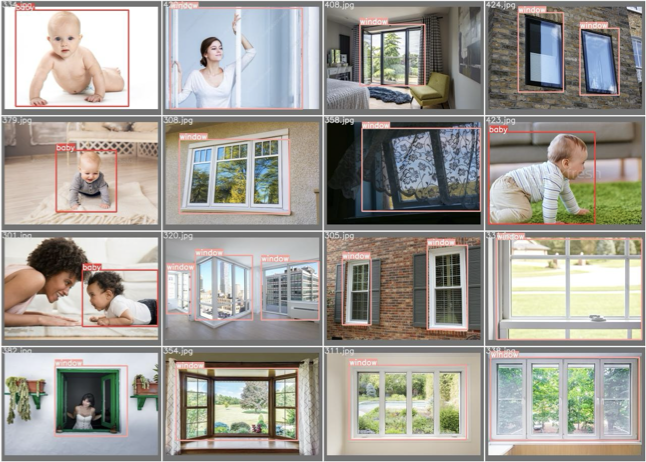
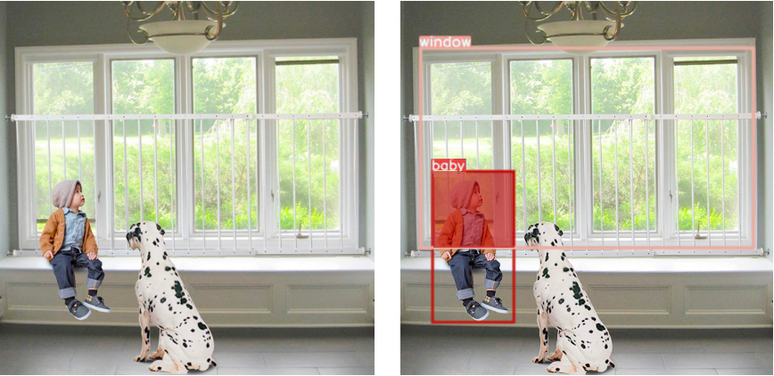

# 基于YoloV8的儿童室内危险检测

> * 姓名：谢冬晨
> * 学号：2023103792

---

## 目录

1. 背景介绍
2. 模型选择与优化
3. 数据集准备
4. 模型训练过程
5. 模型效果展示
6. 未来改进方向
7. 总结
8. 参考文献

---

## 背景介绍

### 需求分析

在现代家庭中，儿童的安全问题始终是家长们最为关注的焦点之一。由于儿童天性活泼好动，他们在家中活动时容易接触到一些潜在的危险，例如：

- 爬上窗台或其他高处，可能导致坠落。
- 触碰电源插座或其他危险电器，可能引发触电事故。
- 接触锋利或有害物品，可能造成受伤。

家长由于工作繁忙，往往无法时刻监控孩子的活动，这就需要一种智能化的解决方案来帮助监测和预警儿童的危险行为。

### 系统设计目标

设计目标是开发一个基于YOLOv8的智能检测系统，能够实时监测家庭环境中的儿童活动，并识别出潜在的危险行为和区域。该系统的主要功能包括：

1. 实时监控儿童活动。
2. 识别危险行为并生成警报。
3. 记录和分析危险行为数据，为家长提供参考。

---

## 模型选择与优化

### YOLOv8简介

YOLO（You Only Look Once）系列模型是一类高效的目标检测算法，YOLOv8是该系列的最新版本。相较于前几代，YOLOv8在检测精度和速度上有显著提升。其改进主要体现在以下几个方面：

- **更高的检测精度**：通过优化网络结构和训练策略，YOLOv8能够更准确地识别图像中的目标。
- **更快的检测速度**：YOLOv8在保证高精度的同时，进一步提升了检测速度，适用于实时检测任务。
- **更好的通用性**：YOLOv8支持多种任务，包括目标检测、分类和实例分割，能够灵活应对不同的应用场景。

### C2f模块

C2f模块是YOLOv8中的一个重要组件，用于特征提取和增强。它通过一系列卷积操作和上采样过程，将输入图像中的特征进行提取和放大，以便后续的目标检测。C2f模块的引入，使得YOLOv8在保持高效检测能力的同时，进一步提升了检测的准确性和速度。

---

## 数据集准备

### 数据收集

为了训练YOLOv8模型，使用了Kaggle上的公开数据集。Kaggle是一个提供各种机器学习和数据科学竞赛的平台，拥有丰富的高质量数据资源。具体步骤如下：

1. **选择合适的数据集**：在Kaggle上筛选和下载包含儿童活动场景和室内物品的图像数据集。
2. **数据预处理**：对下载的数据进行清洗和整理，确保图像质量和格式统一。

### 数据标注

收集到数据后，需要对图像进行标注，标注内容包括：

- **目标对象**：儿童、危险物品等。
- **危险行为**：儿童爬上窗台、接触电源插座等。

数据标注的质量直接影响模型的训练效果，因此采用专业标注工具labelImg，并严格控制标注标准，确保数据标注的准确性和一致性。

---

## 模型训练过程

### 训练参数设置

在模型训练过程中，设置了一些关键参数来优化模型性能，包括：

- **学习率**：通过调节学习率，控制模型的学习速度和稳定性。
- **批次大小**：设置适当的批次大小，平衡训练速度和显存使用。
- **训练轮数**：通过多轮训练，逐步提升模型的检测能力。

### 训练环境配置

在无GPU环境下进行模型训练，具体配置如下：

- **硬件配置**：13th Gen Intel(R) Core(TM) i9-1390。
- **软件配置**：Ubuntu 20.04，PyTorch深度学习框架，YOLOv8模型库。

### 模型训练结果

经过多轮训练和优化，YOLOv8模型在检测儿童室内危险行为方面取得了显著效果。模型在验证集上的准确率和召回率分别达到了83%和79%。

---

## 模型效果

### 实际应用场景

将训练好的YOLOv8模型应用于实际的室内场景，检测并标注了多个危险行为和区域。

### IoU计算

在多目标检测任务中，使用IoU（Intersection over Union）指标来评估检测框的准确性。具体计算过程如下：

1. **获取检测框**：从检测结果中提取出所有目标的检测框。
2. **计算IoU**：对于任意两个检测框，计算其交并比，以评估检测结果的精确度。

通过这些措施，可以更好地评估和改进模型的性能，确保其在实际应用中的可靠性和准确性。

### 检测结果可视化

为了更直观地展示检测效果，对检测结果进行了可视化处理。具体操作如下：

1. **绘制检测框**：在原始图像上绘制检测框，标注出识别出的目标和危险区域。
2. **生成结果**：根据检测结果生成IoU计算结果，供家长和管理人员参考。

---

## 未来改进方向

### 模型优化

模型在检测儿童室内危险行为方面仍有一些改进空间：

- **进一步提升检测精度**：通过引入更多高质量数据和优化训练策略，进一步提升模型的检测精度。
- **降低误报率**：通过改进算法和模型结构，降低误报率，提高系统的可靠性。
- **增加检测种类**：扩展模型的检测能力，识别更多种类的危险行为和物品。

---

## 总结

通过本项目，成功开发了一种基于YOLOv8的儿童室内危险检测系统。该系统通过高效的目标检测算法，实现了对儿童活动的实时监控和危险预警，有效提高了家庭安全系数。未来，我将继续优化和完善该系统，推动其在更多实际场景中的应用。

---

## 参考文献

1. Bochkovskiy, A., Wang, C. Y., & Liao, H. Y. M. (2020). YOLOv4: Optimal Speed and Accuracy of Object Detection. arXiv preprint arXiv:2004.10934.
2. Redmon, J., Divvala, S., Girshick, R., & Farhadi, A. (2016). You Only Look Once: Unified, Real-Time Object Detection. In Proceedings of the IEEE conference on computer vision and pattern recognition (pp. 779-788).
3. Jocher, G., Chaurasia, A., Qiu, J., & Stoken, A. (2021). YOLOv5 by Ultralytics. https://github.com/ultralytics/yolov5.
4. Howard, A., Sandler, M., Chu, G., Chen, L. C., Chen, B., Tan, M., ... & Le, Q. V. (2019). Searching
