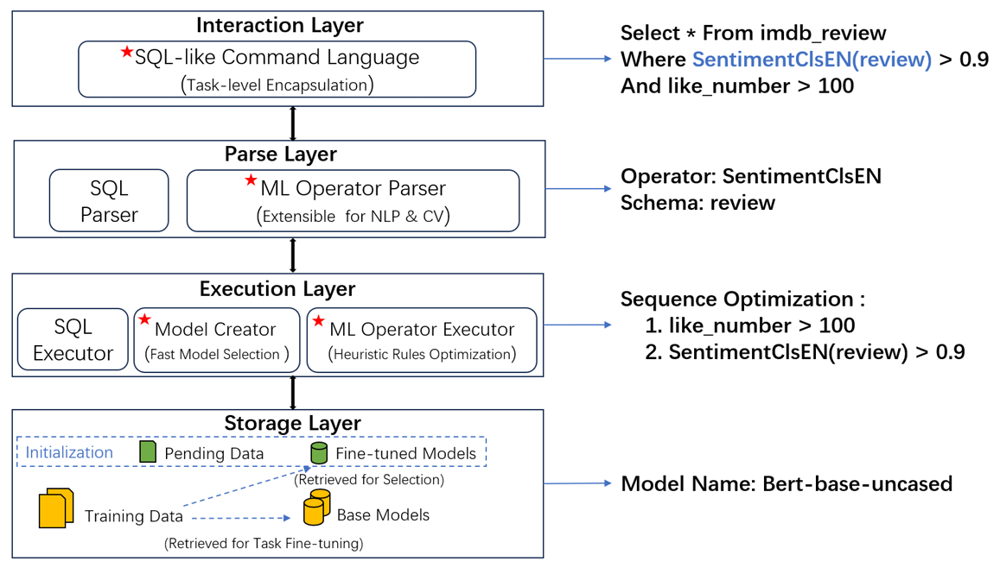
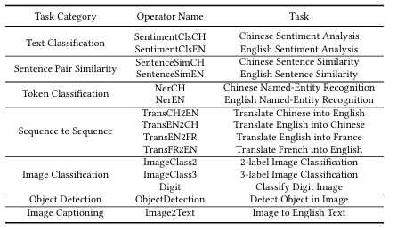
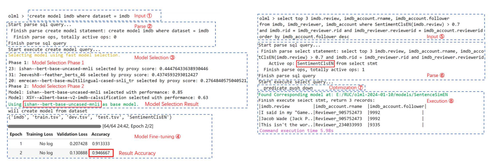

# 基于SQL指令的机器学习系统

机器学习，特别是深度学习模型大大增强了数据分析和处理能力。用于数据分析的传统机器学习通常涉及将数据导出到外部平台进行模型选择和训练，这带来了三个主要挑战，即数据隐私问题，数据分析师缺乏关于给定数据分析任务的合适模型的知识，以及模型创建和训练所需的编程知识。本次作业中实现了一个基于SQL指令的机器学习系统，它为利用机器学习进行数据分析提供了一个全栈的数据库内解决方案。该系统为自动模型选择和微调提供了一种类似sql的语言，不需要数据分析师编程或深入的机器学习知识。此外，系统已经为自然语言处理和计算机视觉任务实现了15个机器学习操作符，并设计了有助于直接在数据库中集成用于各种任务的各种模型，从而解决了数据隐私问题。

## 1. 系统结构



系统架构如图所示，本系统使用python构建，采用典型的数据库四层设计，并根据机器学习场景的需求进行定制。下文中将以自顶向下的方式提供系统的每层解释。

### 1.1交互层

**任务级别的封装**：为了最终减轻用户的工作量，系统被设计成在任务级封装机器学习模型。即用户只需要知道具体的数据分析任务，如情感分析、图像分类、需要分析的数据列，所有模型的选择、创建和训练过程都对用户透明。这是通过类似sql的语言设计和相应的优化实现的。

**类sql语言**：我们增强了SQL语言，使其包含深度学习模型操作的语法，涵盖了模型创建、训练、评估和部署，从而将数据分析功能直接嵌入到标准SQL查询中。这种设计大大简化了数据库用户的流程，最大限度地减少了在数据库中利用深度学习所需的工作量，并简化了从数据查询到高级数据分析的工作流程。上图显示了扩展SQL查询的一个示例，其中系统引入表达式SentimentClsEN(review)>0.9，指定数据列'review'上的情感分析任务，以调用相应的内置深度学习模型。我们有意以类似于用户定义函数的样式设计模型调用语法，旨在进一步简化用户的学习过程。

### 1.2解析层

该层将增强的SQL查询解析为内部数据结构，然后将其传递给执行层。标准的SQL查询被解析为传统的关系数据库，而深度学习相关的语法被解析为机器学习操作符，这是一种为深度学习功能设计的内部数据结构。
**机器学习运算符**：系统在解析器层定义了一个内部数据结构，以支持机器学习模型的任务级封装。每个数据分析任务对应一个机器学习运算符。每个运算符下存储有可用的模型。为了考虑可扩展性，操作符和模型都是以面向对象的方式设计的。下表显示了系统当前支持的操作符和任务。系统的模型计算框架利用了HuggingFace，这是最受欢迎的机器学习平台之一，包含全面的模型库。与HuggingFace的集成增强了系统的适应性，使其能够适应广泛的任务和机器学习模型。



### 1.3执行层

执行层在接收到已解析的数据(包括操作符和列名)后，从存储层检索必要的信息并计算结果。它根据可用的训练数据为任务选择最合适的模型，或者在没有合适的现有模型时启动模型创建。为了提高效率，逻辑和物理优化都是专门为机器学习操作设计的。

**模型选择**：给定一个数据分析任务，系统首先尝试从可用模型中选择最适合该任务的模型。为了实现这一目标，系统采用了最先进的模型选择算法（见paper），该算法采用两阶段法，根据数据识别理论理想模型进行微调。第一阶段基于各种基准任务中的模型效应执行粗召回，第二阶段基于之前的微调趋势选择结果模型。

**模型创建**：在没有适合给定任务的模型的情况下，系统可以使用自身的模型创建方法，为给定任务选择的基本模型(使用上面提到的模型选择过程)基于给定的数据进行微调。模型创建过程由带有条件子句的创建模型查询激活，该条件子句指示强制微调数据集和(可选的)超参数。数据集包含引用其任务的元数据。通过指定数据集，系统可以解析微调任务，并使用相关数据进行模型选择，以选择进行微调的基本模型。系统使用HuggingFace对指定模型进行微调[7]，该方法规范了数据预处理方法和其框架内的不同模型。因此，系统可扩展到不同类型的模型和任务。

**机器学习算子特定优化**：机器学习算子相对于传统算子而言，由于GPU上的计算量较大，因此耗时较长。因此，我们应该尽可能减少GPU上的计算量。我们设计了针对机器学习操作符的逻辑和物理优化，以提高执行效率。对于逻辑优化，我们的目标是通过下推所有过滤条件来推迟GPU计算，直到必要时，从而最小化GPU处理所需的数据。此外，在GPU上要处理的数据发生任何连接操作之前，我们主动安排GPU上的计算，确保GPU上只计算最少需要的数据。至于物理优化，我们利用表元数据来获取连接操作中涉及的表的精确大小信息。这允许我们做出明智的决定，并通过采用贪婪方法来优化资源利用和处理效率，有选择地优先考虑较小的表。

### 1.4存储层

该层存储系统的模型和数据。使用特殊的管理策略来保持系统的效率。

**数据管理**：系统中的数据分为训练数据和待处理数据。训练数据是指有标记的数据，用于对模型进行微调，待处理数据是未标记的数据，等待处理。这两个数据都存储在tsv文件中，元数据保存在特殊的表中。训练数据具有与微调任务相关的元数据。当用户使用确定的数据集对基本模型进行微调时，系统检索数据集的元数据以获得微调任务。由于暂挂数据的处理频率高于训练数据，系统在初始化时将暂挂数据加载到内存中，而将训练数据留在磁盘中，从而将最常用的项保留在内存中，减少加载时间。

**模型管理**：每个模型都存储在以模型名称命名的文件夹中，格式与Huggingface model Hub中的模型保存格式相同。可以使用git clone命令从Huggingface Model Hub获取模型到本地。这些模型可以分为基本模型(未微调)和微调模型。模型的元数据保存在特殊的表中。微调模型具有与其操作符相关的元数据。当机器学习操作符被激活时，系统检索这些元数据来搜索适合当前操作符的现有模型。如果有多个表可用，系统检索微调模型的训练数据集元数据，以获得用于计算的内容相似的模型。由于在数据处理场景中，模型推理比模型微调更频繁，系统在初始化时加载微调模型，并将基本模型留在磁盘中，以减少频繁加载模型的时间。

## 2.代码释义

该部分对代码关键内容进行解释。

### 2.1 olml.py

该文件是启动文件，运行该文件以启动系统，系统启动时会初始化加载表格和机器学习算子对应的模型。输入sql指令后，会调用相应的函数解析并执行。

### 2.2 /sql/parser.py

该文件负责解析输入的sql语句，其中SQLParser类调用sqlparse类对sql语句进行粗略分割，根据分割后的结果判断语句的类型，进而生成一个对应的Stmt类（statement简写）对语句进行详细解析。其中BaseStmt是各类中的基类，规定了基础的成员和方法，各类语句对应的类由此派生，如创建表格的CreateTableStmt，创建模型的CreateModelStmt，搜索语句SelectStmt。语句中的条件从句封装在类Conditions中，每个条件封装在类Condition中。

### 2.3 /op/model.py

该文件通过一系列类对各模型实现封装，是系统在交互层面实现任务级别封装的核心之一。基类DNNModel（Deep Neural Network Model）定义了模型最基本的成员和方法：

```python
class DNNModel:
    def __init__(self, model_record):
        self.name = model_record[0]
        self.dataset_name = model_record[1]
        self.model_path = model_record[2]
        """
        add load mark to show where the model currently be
        1 for GPU
        0 for CPU
        """
        self.load = 0
        self.tokenizer = AutoTokenizer.from_pretrained(self.model_path)
        self.model = AutoModelForSequenceClassification.from_pretrained(self.model_path)
        self.model.to('cuda')
        self.load = 1

    def load_model(self):
        self.model.to('cuda')
        self.load = 1

    def unload_model(self):
        self.model.to('cpu')
        self.load = 0

    def compute(self, op_input, attr_values):
        """
        add transfer_to_gpu for NOT pre_load case
        """
        if self.load != 1:
            self.load_model()
        if op_input is None:
            results = []
            for attr_value in attr_values:
                inputs = self.tokenizer(attr_value, return_tensors='pt', truncation=True, padding=True, max_length=128)
                inputs.to('cuda')
                with torch.no_grad():
                    logits = self.model(**inputs).logits
                result = logits.softmax(dim=1).squeeze().tolist()
                results.append(result[0])
            return results
        else:
            # here op_input is added to every attr_value for calculation
            results = []
            for attr_value in attr_values:
                inputs = self.tokenizer(op_input + '\t' + attr_value, return_tensors='pt', truncation=True,
                                        padding=True, max_length=128)
                inputs.to('cuda')
                with torch.no_grad():
                    logits = self.model(**inputs).logits
                result = logits.softmax(dim=1).squeeze().tolist()
                results.append(result[0])
            return results
```

其中成员tokenizer是分词器，model是模型本身，这两个成员通过HuggingFace的Transformers库的方法加载，因此HuggingFace上大量的模型都能在系统内使用。方法compute是核心，它接收一个包含要处理的数据列的列表，交由模型推理后返回推理的结果。实现不同任务的模型由DNNModel派生，例如负责句对相似度任务的模型类SentenceSimModel，负责中英翻译的模型类TransCH2ENModel等。

### 2.4 /op/op.py

该文件负责封装机器学习算子，算子在初始化时会加载符合对应模型类的模型，在被调用时，算子会在这些模型中选择一个最接近的来使用。

### 2.5 /ModelSelection

该文件内包含模型选择的相关代码和内容，系统实现时对其进行了修改使其能在系统内调用。

## 3.实验展示

该任务场景下，系统要从IMDB电影评论数据集中选择最有价值的差评。给出了三个相关表格，其中包含审稿文本和审稿人相关信息。没有现成的模型可用于此任务。



### 3.1模型创建查询

第一步包括创建一个能够计算情感分数的模型，通过类sql语句查询**create model imdb where dataset = imdb**;需要注意的是，用户并不需要掌握任务所需的特定模型的知识;相反，他们只需要在查询中指定数据集。

### 3.2模型创建查询解析

在解析查询后，系统提取数据集名称并继续搜索数据集元数据。检查后，系统识别一个列，该列记录了对数据集进行微调的任务。在本例中，数据集imdb与任务SentimentClsEN相关联，表明它包含情感分类模型选择的相关数据。

### 3.3模型选择

系统启动一个两阶段的快速模型选择过程，以确定用于微调的最佳基本模型。在第1阶段，系统根据代理得分召回几个模型，并给出前3个选项。在阶段2中，根据模型在各个历史时期的性能趋势选择模型，并提供前2个选择。最后，系统确定与指定任务最一致的基本模型。

### 3.4模型微调

系统使用给定的数据集对模型进行微调，当加载到OLML中时，数据集被分成3部分，即训练、测试和验证集。微调超参数由模型选择中使用的默认值决定。最后给出了训练结果。

### 3.5选择查询

在对模型进行微调之后，下一步包括选择所需的审查以及审查者信息。这需要连接三个表并使用适当的操作符过滤负面评论。考虑到我们对高度关注的评论者的评论进行优先级排序，我们根据关注者的数量对结果进行排序。值得注意的是，该查询以函数格式调用机器学习计算，函数名称与任务名称相对应。这种方法确保了应用过程中用户的简单性和易于理解性。

### 3.6选择查询解析

系统解析器继续解析查询，以提取有关所选表、投影列和条件的信息。扫描已解析的单元后，解析器确认调用了SentimentClsEN来计算列审阅的情感评分。随后，激活该算子并准备计算，并确定执行顺序。

### 3.7执行优化

系统考虑多个连接和条件的存在来优化执行序列。机器学习操作符SentimentClsEN(imdb.review) > 0.7在连接操作之前执行，这可能会潜在地增加计算的行数。连接顺序是根据三个表中的行数确定的，以确保效率。一旦相关表连接在一起，就执行最后两个条件，从而简化了整个执行过程。

### 3.8执行结果

机器学习算子搜索可用的微调模型进行处理，得到我们在前一次查询中微调过的模型。结果打印出来自拥有最多追随者的评论者的三个负面评论。
OLML擅长于完成数据处理任务，包括模型选择、微调、部署和数据处理，所有这些都是通过简单的类似sql的模型创建和选择查询完成的。使用OLML，用户不需要具备任何机器学习的先验知识，因为它为利用机器学习模型的数据分析提供了完全自动化的端到端解决方案