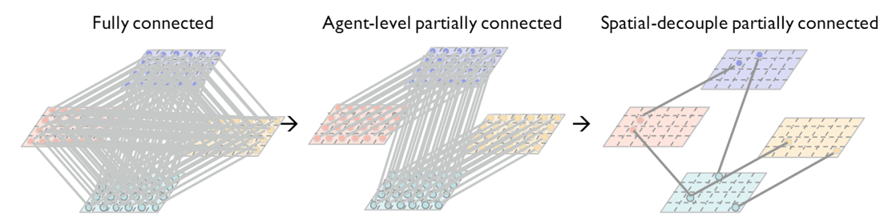
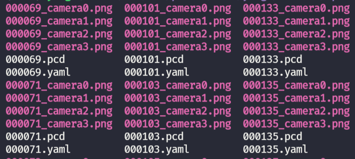
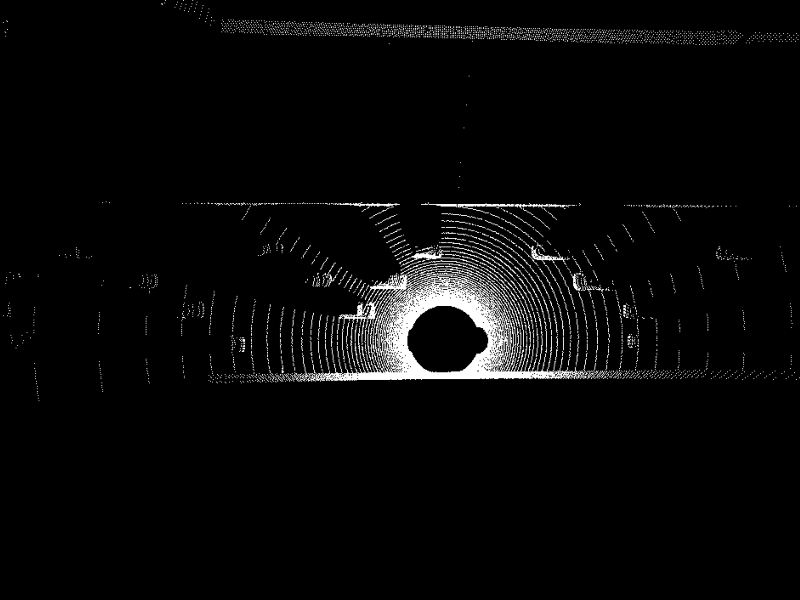
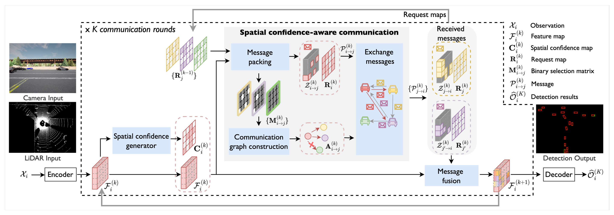
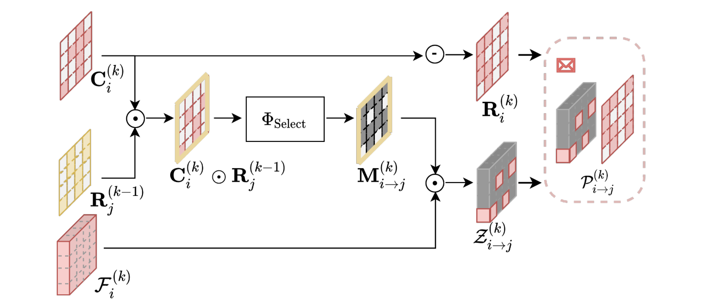
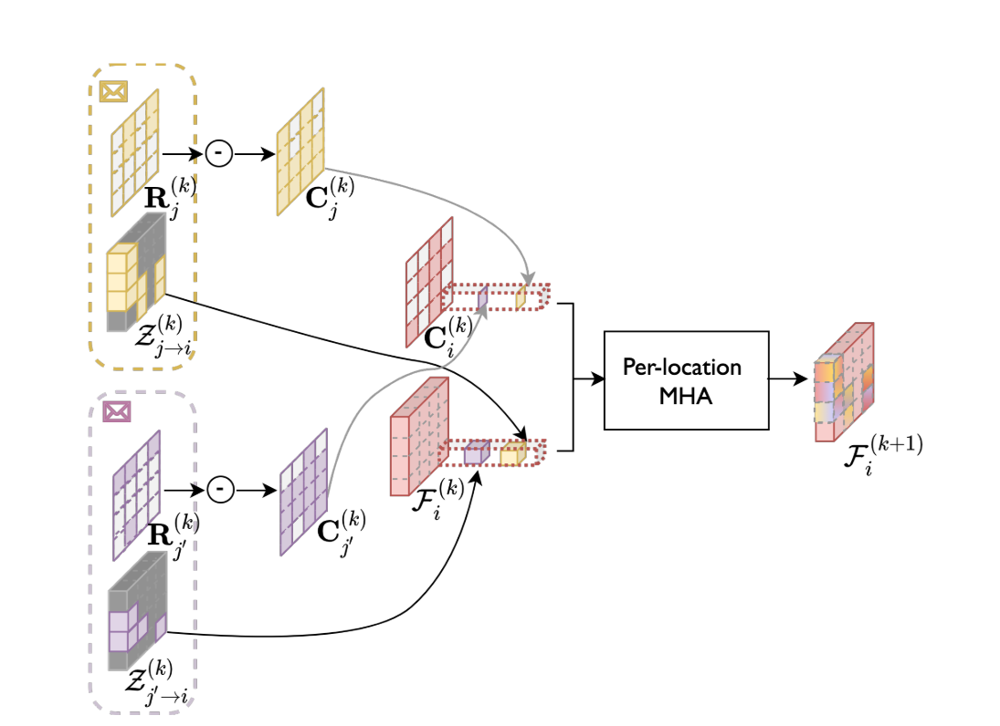
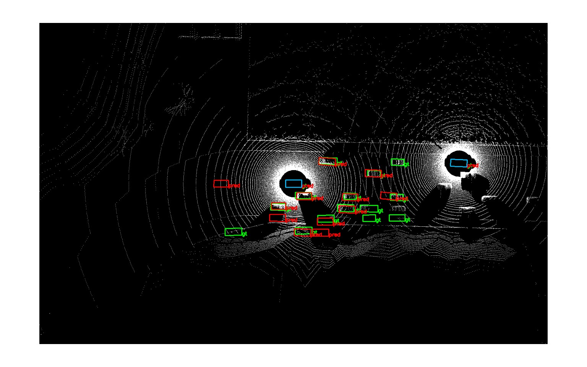
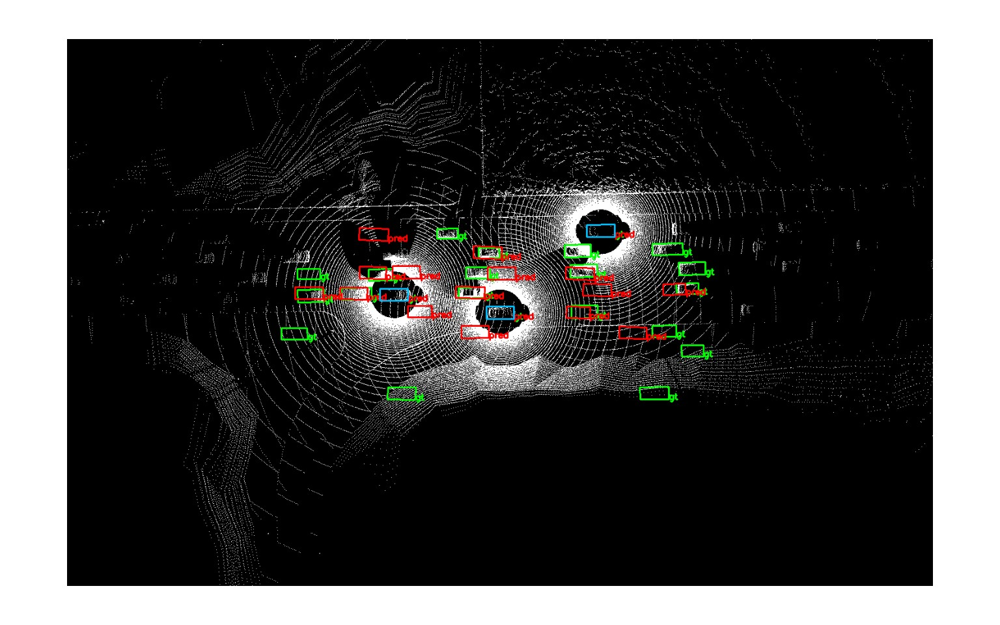

# 多协同感知

## 1. 任务背景

**自动驾驶协同感知(Autonomous Driving Cooperative Perception)**
是自动驾驶技术中的一个重要概念，它指的是通过多个自动驾驶车辆或系统之间的信息共享和协作，以提高对周围环境的感知能力。这种感知方式不仅依赖于单一车辆的传感器数据，还结合了其他车辆的感知数据，从而实现更全面、更准确的环境理解。

**核心组成部分：**

1. **传感器融合**：每辆自动驾驶车辆都装备有多种传感器，如雷达、激光雷达（LiDAR）、摄像头等，用于收集车辆周围的环境信息。协同感知通过融合这些传感器的数据，可以提供更丰富的环境信息。
2. **车辆间通信**：车辆之间通过无线通信技术（如车对车通信，V2V）交换感知数据和信息。这使得每辆车都能够获取到其他车辆的感知数据，从而扩展其感知范围。
3. **数据处理与分析**：收集到的数据需要通过高级算法进行处理和分析，以识别和理解环境中的物体、道路条件、交通信号等信息。
4. **决策制定**：基于综合感知结果，自动驾驶系统能够制定更加精确和安全的驾驶决策。

该项目中，输入信息是雷达点云图，输出信息是周边环境存在车辆的位置。

**核心问题：如何在有限的通信带宽和感知性能之间取得平衡**

这个问题的挑战在于，当多个智能体（如自动驾驶车辆或无人机）协作共享感知信息时，它们需要在通信的效率和所获得的感知质量之间做出权衡。

- 在全连接方式中，每个节点将自己的所有信息发送给所有其它节点，通信开销非常大，带宽要求高。
- 第二种方式是自己只选择向一个节点发送信息。
- 然而事实上并不需要将所有信息发送给其它节点，例如对于两个节点都能够感知到的区域是不需要交换信息的。此外对于两个节点都感知不到的区域同样也是不需要交换信息的，交换的信息应当是其中一个节点能够感知到，而另外一个节点不能感知到的区域。

## 2. 实验数据集

**OPV2V**  https://drive.google.com/drive/folders/1dkDeHlwOVbmgXcDazZvO6TFEZ6V_7WUu

OPV2V数据集是一个专注于车对车(V2V)通信的大规模开放模拟数据集，用于自动驾驶车辆的协同感知研究。

它包括12000帧的3D点云和RGB图像，以及230000个带注释的3D边界框。感知范围是40m*40m。

## 3. 模型框架

- 首先是环境信息输入，可以是相机照片，也可以是雷达图。经过编码后得到原始的信息F

- **Spatial confidence generator** 能够生成空间自信度的信息，代表自己对于哪些区域是自信的。对于自动驾驶来说，它表明自己可以肯定这些地方有或没有车辆，而像例如被障碍物遮挡的区域，自己就不太确定是否有车辆，需要通过其它协同车辆提供的信息来判断。

- **Message packing阶段**
R表示对空间某些位置的“不自信”，即代表“需求”。其它颜色的R表示接收到的由其它节点发送来的“需求”，这些需求和自己的“自信”区区域相乘得到稀疏消息图M，即代表了当前节点需要将空间的哪些位置信息发送给其它节点，因为它满足了：

  1. 自己“自信”，即自己是知道这些位置是否有车辆
  2. 别人"不自信"，即协同节点不知道这些位置的信息。

  将M与自己的信息特征图F做信息提取就得到Z，代表着自己需要发送给其它节点特征图。

- **Message fusion阶段**， 将自己的特征图和其它节点发送的特征图融合，经过多头注意力就得到了对整个空间较为全面的信息表示，作为下一个特征图。经过一个解码器最终得到环境车辆的位置。

## 4. 实验结果

实验在这个大体架构的基础上进行架构调整，例如在fusion模块中，添加图卷积网络GCN来实现特征融合，是其能够拓展到特定车辆间不能相互通信的场景；

实验基于opencood，是目前流行的协同感知基本框架，可以可以快速搭建环境、写代码。

实验结果如下：

- 蓝色框为协同车辆
- 绿色框为需要预测的环境中存在的车辆
- 红色框为模型给出的预测

